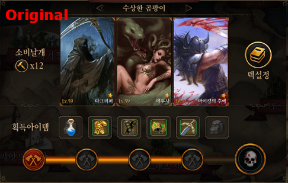
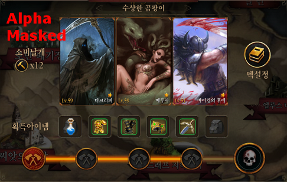

Unity-NGUIExtension
===================

Various NGUI extension modules.

Modules
-------
* **UIShaderSprite** - It enables to apply and specify shader on each of sprite in the atlas. (It will work on NGUI 3.7.0 or higher version)

* **Alpha Masked shader** - It enables to use compressed image format for an Atlas image file, PVRTC on iOS and ETC on Android. Both of format are 4bits so it reduces image size to 1/4. Inspired by [unity-alphamask](https://github.com/keijiro/unity-alphamask). See also [Texture Compression](http://egloos.zum.com/littles/v/3439290)(Korean only) for more details about benefit of using PVRTC on iOS and ETC1 on Android device.

The problem of using alpha maksed image approach can be found on a translucent sprite. Using alpha-masked approach is not good for translucent image. The image can be more translucent due to lack of color pixels. See the following images:

References
-----------

Other useful NGUI modules found on github.

* [NGUI Additions](https://github.com/yeticrabgames/NGUIAdditions)
* [MateNGUI](https://github.com/ddionisio/MateNGUI)
* [DataBinderForNGUI](https://github.com/kyubuns/DataBinderForNGUI)
* [UIUnityRenderer](https://github.com/tarob19/UIUnityRenderer) manages NGUI widgets to use that together with other gameobjects which contain ParticleSystem or MeshRenderer by its depth.